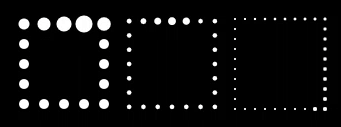

## Spinning Star Drawable

This project provides a sample of how to add an animated custom drawable to a toolbar.

A full guide explaining how to use and animate custom drawables can be found here: [Custom Drawables and Animations](http://bleeding182.blogspot.co.at/2016/01/custom-drawables-and-animations.html)

For the code take a look at [SpinningStarDrawable](/SpinningStar/app/src/main/java/at/bleeding182/samples/spinningstar/SpinningStarDrawable.java)

## Indeterminate progress bar drawable

This sample also features a proof of concept for an indeterminate rectangular progress bar. This was used as a proof of concept for [Modifying the resource image of Progress Bar](http://stackoverflow.com/questions/34536075/modifying-the-resource-image-of-progress-bar)

The code can be found [here](/SpinningStar/app/src/main/java/at/bleeding182/samples/spinningstar/RectProgressDrawable.java)).